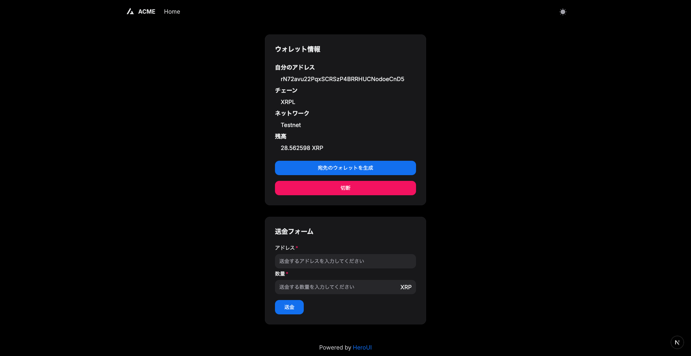

# Next.js & HeroUI + XRPL スターター

このプロジェクトは、Next.js 14（appディレクトリ構成）とHeroUI v2、XRPL（Ripple Ledger）連携をベースにしたスターターです。

## 🚀 アプリでできること

- **GemWallet接続**
  - アドレス取得
  - ネットワーク取得
  - XRP残高取得
- 送金先ウォレット生成
- 送金

## 画面イメージ



## 🛠 主な技術スタック

- [Next.js 14](https://nextjs.org/docs/getting-started)
- [HeroUI v2](https://heroui.com/)
- [Tailwind CSS](https://tailwindcss.com/)
- [TypeScript](https://www.typescriptlang.org/)
- [XRPL (xrpl.js)](https://github.com/XRPLF/xrpl.js#readme)
- [GemWallet](https://gemwallet.app/docs/user-guide/introduction)

## 📁 ディレクトリ構成

- `app/`         : Next.js 14のApp Router構成
- `components/`  : UIコンポーネント群
- `hooks/`       : カスタムフック（例: useWallet）
- `libs/`        : XRPLやGemWallet連携用ユーティリティ
- `types/`       : 型定義
- `config/`      : サイト設定やフォント設定
- `styles/`      : グローバルCSSやTailwind設定

## ⚡️ セットアップ

依存パッケージのインストール（pnpm推奨）:

```bash
pnpm install
```

開発サーバー起動:

```bash
pnpm run dev
```

### pnpm利用時の注意

pnpmを使う場合は、`.npmrc`に以下の設定が必要です:

```
public-hoist-pattern[]=*@heroui/*
```

設定後、`pnpm install`を再度実行してください。

## 📄 ライセンス

[MIT license](./LICENSE)
